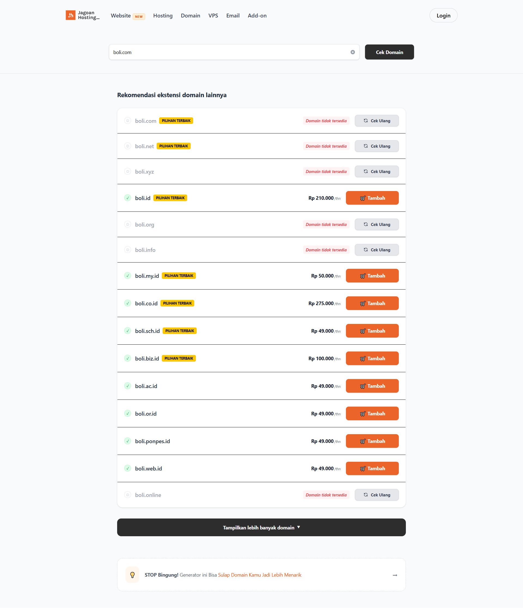
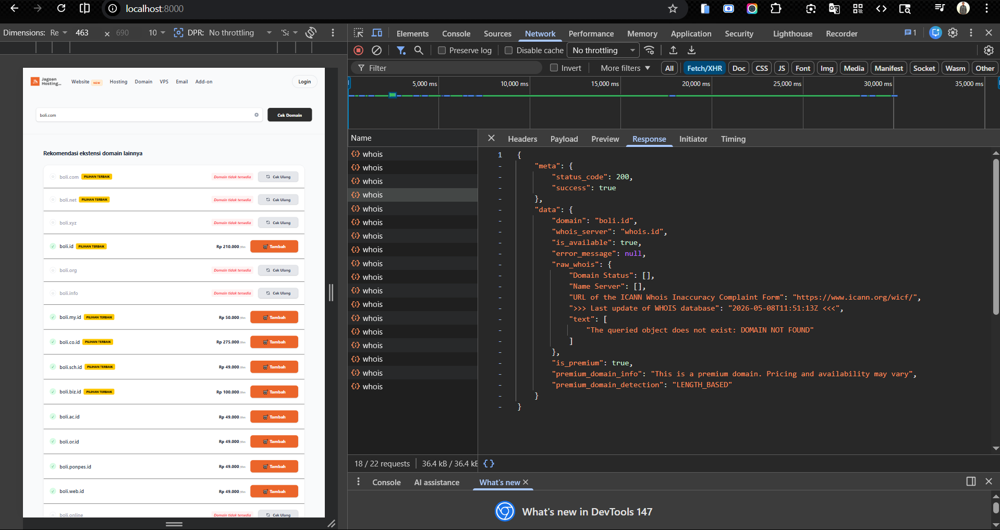
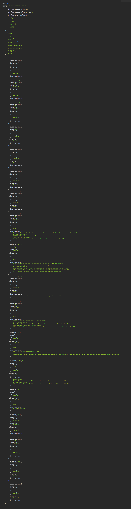

---

Sistem pencarian domain interaktif yang dibangun menggunakan stack modern: **Laravel 12**, **Inertia.js (React)**, dan **Tailwind CSS**. Aplikasi ini memungkinkan pengguna untuk mengecek ketersediaan berbagai ekstensi domain secara *real-time* melalui integrasi API Whois Jagoan Hosting.

---

## Preview



---

## Fitur Utama

* **Real-time Domain Checker**: Integrasi API Whois untuk pengecekan status ketersediaan domain secara instan.
* **Dynamic Configuration**: Pengaturan harga, ekstensi domain, dan limit tampilan dikelola melalui file konfigurasi JSON di sisi server.
* **Spotlight Badge**: Menandai ekstensi domain tertentu sebagai "Pilihan Terbaik" berdasarkan konfigurasi.
* **Recheck System**: Fitur untuk melakukan pengecekan ulang status domain secara mandiri pada setiap kartu hasil.
* **Responsive UI/UX**: Antarmuka bersih dan modern yang dioptimalkan untuk perangkat mobile maupun desktop menggunakan Tailwind CSS.
* **Load More Pagination**: Sistem pemuatan hasil pencarian yang efisien untuk menangani puluhan ekstensi domain sekaligus.

---

## Tech Stack

### Backend (Server Side)

* **Framework**: Laravel 11
* **Language**: PHP 8.x
* **API**: RESTful API untuk penyajian konfigurasi domain.





### Frontend (Client Side)

* **Framework**: React.js (via Inertia.js)
* **Styling**: Tailwind CSS
* **State Management**: React Hooks (`useState`, `useEffect`)
* **HTTP Client**: Axios

---

## Struktur Proyek & Kode Penting

### 1. Konfigurasi Backend (`DomainController.php`)

Mengambil data dari `storage/app/domain_config.json` dan menyajikannya ke frontend.
![Masukkan Gambar Potongan Kode Controller atau Flow API Disini]

### 2. Komponen Kartu Domain (`DomainCard.jsx`)

Menangani logika individual setiap domain, termasuk format harga mata uang Rupiah (IDR) dan fungsi *re-check*.
![Masukkan Gambar Detail Kartu Domain Disini]

### 3. Halaman Utama (`DomainSearch.jsx`)

Pusat navigasi dan mesin pencari yang mengoordinasikan input pengguna dengan hasil API Whois.

---

## Instalasi

1. **Clone Repository**
```bash
git clone https://github.com/username/domain-search.git
cd domain-search

```

2. **Install Dependencies**
```bash
composer install
npm install

```

3. **Konfigurasi Environment**
Salin file `.env.example` menjadi `.env` dan atur koneksi database (jika diperlukan).
4. **Siapkan File Konfigurasi Domain**
Pastikan file `domain_config.json` tersedia di folder `storage/app/`.
```json
{
  "config": {
    "SEARCH_DOMAIN_LIMIT_SHOW_DOMAIN": "15",
    "SEARCH_DOMAIN_SPOTLIGHT": [".com", ".id"]
  },
  "extensions": [ ... ]
}

```

5. **Run Development Server**
```bash
php artisan serve
npm run dev

```

---

## Integrasi API

Aplikasi ini terhubung dengan endpoint pihak ketiga untuk validasi domain:

* **Endpoint**: `https://dev-whois.jagoanhosting.com/api/v2/whois`
* **Method**: `POST`
* **Header**: `X-WHOIS-AUTH`

**Developed with by Ma'ruf Hariam**